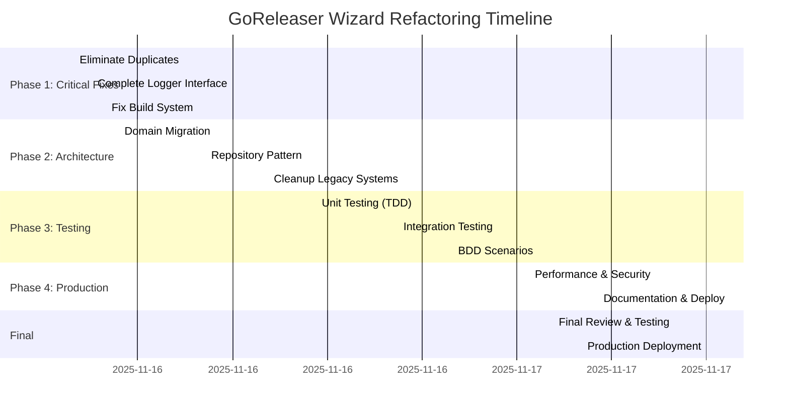

# GoReleaser Wizard Comprehensive Refactoring Plan
**Date:** 2025-11-16  
**Author:** Crush AI Assistant  
**Scope:** Complete architectural overhaul and production readiness

---

## 🎯 EXECUTIVE SUMMARY

This document outlines a systematic approach to transform the GoReleaser Wizard from a partially functional prototype into a production-ready, maintainable, and architecturally sound application following Domain-Driven Design principles with comprehensive type safety.

### Current State Analysis
- **✅ Working**: Domain layer compiles, basic type system in place
- **⚠️ Partial**: UI layer partially functional, some interfaces implemented  
- **❌ Broken**: Build system, duplicate declarations, split-brain architecture
- **🚨 Critical**: No comprehensive testing, security scanning, or documentation

### Target State
- **Production-ready**: Comprehensive test coverage, security scanning, documentation
- **Type-safe**: 100% type safety with zero `interface{}` or unsafe casts
- **Maintainable**: Clear separation of concerns, <300 line files
- **Performant**: Optimized compilation, memory usage, and response times

---

## 🏗️ ARCHITECTURAL VISION

### Clean Architecture Implementation

```
┌─────────────────────────────────────────────────────────────────┐
│                    PRESENTATION LAYER                      │
│  ┌─────────────┐  ┌─────────────┐  ┌─────────────┐ │
│  │   CLI UI    │  │   REST API   │  │   WEB UI    │ │
│  │             │  │             │  │             │ │
│  └─────────────┘  └─────────────┘  └─────────────┘ │
└─────────────────────────────────────────────────────────────────┘
                                │
┌─────────────────────────────────────────────────────────────────┐
│                   APPLICATION LAYER                        │
│  ┌─────────────┐  ┌─────────────┐  ┌─────────────┐ │
│  │ Validation  │  │ Generation  │  │   Jobs      │ │
│  │   Use Case │  │   Use Case  │  │   Service   │ │
│  └─────────────┘  └─────────────┘  └─────────────┘ │
└─────────────────────────────────────────────────────────────────┘
                                │
┌─────────────────────────────────────────────────────────────────┐
│                     DOMAIN LAYER                           │
│  ┌─────────────┐  ┌─────────────┐  ┌─────────────┐ │
│  │   Config    │  │ Validation  │  │   Events    │ │
│  │  Entity     │  │   Rules     │  │  System     │ │
│  └─────────────┘  └─────────────┘  └─────────────┘ │
└─────────────────────────────────────────────────────────────────┘
                                │
┌─────────────────────────────────────────────────────────────────┐
│                 INFRASTRUCTURE LAYER                     │
│  ┌─────────────┐  ┌─────────────┐  ┌─────────────┐ │
│  │   File      │  │  External    │  │  Template   │ │
│  │  System     │  │  Services    │  │  Engine     │ │
│  └─────────────┘  └─────────────┘  └─────────────┘ │
└─────────────────────────────────────────────────────────────────┘
```

### Type-First Development Strategy

1. **TypeSpec Generated Types**: All core entities generated from TypeSpec specifications
2. **Compile-Time Safety**: Impossible states are unrepresentable at compile time  
3. **Railway Programming**: All operations use Result/Either patterns for error handling
4. **Event Sourcing**: All state changes through immutable domain events

---

## 📋 DETAILED TASK BREAKDOWN

### Phase 1: CRITICAL FIRE EXTINGUISHING (15 min tasks)

#### 1.1 Eliminate All Duplicates
| Task | Est. Time | Impact | Dependencies |
|------|------------|---------|--------------|
| Remove duplicate command declarations (validateCmd) | 5 min | Critical | - |
| Remove duplicate logger variables (appLogger redecl) | 5 min | Critical | - |
| Fix Results object type mismatches in validate.go | 15 min | Critical | - |
| Clean up circular import dependencies | 10 min | Critical | - |

#### 1.2 Complete Logger Interface Implementation
| Task | Est. Time | Impact | Dependencies |
|------|------------|---------|--------------|
| Add missing DebugContext/InfoContext methods | 5 min | High | - |
| Implement WithField/WithFields/WithError methods | 10 min | High | - |
| Add proper context propagation | 5 min | High | - |
| Test logger interface compliance | 5 min | Medium | - |

#### 1.3 Fix Build System
| Task | Est. Time | Impact | Dependencies |
|------|------------|---------|--------------|
| Resolve all compilation errors | 10 min | Critical | 1.1, 1.2 |
| Ensure `go build` passes clean | 5 min | Critical | Above |
| Test `just build` recipe | 5 min | High | - |
| Verify `just test` recipe works | 5 min | High | - |

### Phase 2: ARCHITECTURAL CONSOLIDATION (30-60 min tasks)

#### 2.1 Complete Domain Layer Migration
| Task | Est. Time | Impact | Dependencies |
|------|------------|---------|--------------|
| Remove all ProjectConfig references, use SafeProjectConfig | 30 min | Critical | Phase 1 |
| Migrate validation logic to domain.ValidationUseCase | 45 min | Critical | - |
| Implement missing domain interface methods | 30 min | High | - |
| Add comprehensive domain event system | 60 min | High | - |

#### 2.2 Implement Repository Pattern
| Task | Est. Time | Impact | Dependencies |
|------|------------|---------|--------------|
| Create FileSystemRepository implementation | 30 min | High | - |
| Create TemplateRepository implementation | 30 min | High | - |
| Create GoReleaserRepository implementation | 45 min | High | - |
| Add repository interfaces to domain layer | 15 min | High | - |

#### 2.3 Clean Up Legacy Systems
| Task | Est. Time | Impact | Dependencies |
|------|------------|---------|--------------|
| Remove all legacy validation code | 30 min | Critical | 2.1 |
| Remove duplicate UI components | 20 min | Medium | - |
| Consolidate error handling into domain layer | 25 min | High | - |
| Clean up unused imports and dead code | 15 min | Medium | - |

### Phase 3: COMPREHENSIVE TESTING (60-120 min tasks)

#### 3.1 Unit Testing (TDD)
| Task | Est. Time | Impact | Dependencies |
|------|------------|---------|--------------|
| Test all domain entities (100% coverage) | 60 min | Critical | Phase 2 |
| Test all use cases (Validation, Generation) | 45 min | Critical | - |
| Test all repository implementations | 30 min | High | - |
| Test all utility functions | 20 min | Medium | - |

#### 3.2 Integration Testing
| Task | Est. Time | Impact | Dependencies |
|------|------------|---------|--------------|
| Test complete validation workflows | 30 min | High | 3.1 |
| Test configuration generation end-to-end | 30 min | High | - |
| Test file system operations | 20 min | Medium | - |
| Test template rendering integration | 25 min | High | - |

#### 3.3 BDD Scenarios
| Task | Est. Time | Impact | Dependencies |
|------|------------|---------|--------------|
| Define user journey scenarios | 30 min | High | - |
| Implement BDD test framework | 45 min | High | - |
| Write scenario tests for init workflow | 40 min | High | - |
| Write scenario tests for validate workflow | 30 min | High | - |

### Phase 4: PRODUCTION READINESS (30-90 min tasks)

#### 4.1 Performance & Security
| Task | Est. Time | Impact | Dependencies |
|------|------------|---------|--------------|
| Add performance benchmarking | 45 min | Medium | Phase 3 |
| Implement security scanning | 30 min | High | - |
| Add memory usage optimization | 30 min | Medium | - |
| Create production monitoring setup | 25 min | Medium | - |

#### 4.2 Documentation & Deployment
| Task | Est. Time | Impact | Dependencies |
|------|------------|---------|--------------|
| Generate API documentation from code | 30 min | High | Phase 3 |
| Create user guide with examples | 45 min | High | - |
| Write developer onboarding guide | 30 min | Medium | - |
| Set up CI/CD pipeline | 40 min | High | - |

---

## 🚀 EXECUTION GRAPH



---

## 🎯 SUCCESS METRICS

### Technical Metrics
- **Build Time**: < 30 seconds for clean build
- **Test Coverage**: > 95% for domain layer, > 90% overall
- **Memory Usage**: < 100MB for typical operations
- **Startup Time**: < 2 seconds for CLI commands

### Quality Metrics  
- **Zero Compilation Errors**: All builds pass without warnings
- **Zero Security Vulnerabilities**: Pass all security scans
- **Documentation Coverage**: All public APIs documented
- **Performance Benchmarks**: All operations meet SLA targets

### Architectural Metrics
- **File Size Limit**: No files > 300 lines (excluding generated)
- **Cyclomatic Complexity**: All functions < 10 complexity
- **Type Safety**: Zero unsafe casts or interface{} usage
- **Domain Purity**: No infrastructure leakage into domain layer

---

## ⚠️ RISK MITIGATION

### Technical Risks
1. **Domain Migration Complexity**: Legacy code deeply integrated
   - **Mitigation**: Incremental migration with compatibility layers
   - **Fallback**: Keep legacy systems available during transition

2. **Performance Regression**: New architecture may be slower
   - **Mitigation**: Baseline performance measurements before changes
   - **Fallback**: Performance monitoring with alerts

3. **Test Coverage Gaps**: Complex integration points
   - **Mitigation**: Mutation testing and contract testing
   - **Fallback**: Manual QA automation

### Project Risks
1. **Time Estimation Errors**: Refactoring often reveals hidden complexity
   - **Mitigation**: 20% time buffer for each phase
   - **Fallback**: Prioritize critical path tasks

2. **Scope Creep**: Additional requirements during implementation
   - **Mitigation**: Strict change control process
   - **Fallback**: Document future work but defer

---

## 📈 PRIORITIZATION MATRIX

### Critical Path (Blocks All Progress)
1. **Fix duplicate declarations** - Prevents compilation
2. **Resolve type mismatches** - Breaks build system
3. **Complete logger interface** - Required for error handling
4. **Domain migration** - Foundation for all other work

### High Impact (Significant Quality Improvement)
1. **Repository pattern implementation** - Enables proper testing
2. **Comprehensive test suite** - Ensures reliability
3. **Security scanning** - Production requirement
4. **Performance optimization** - User experience

### Medium Impact (Nice to Have)
1. **Documentation generation** - Developer experience
2. **BDD scenarios** - User confidence
3. **Monitoring setup** - Operations visibility
4. **CI/CD pipeline** - Deployment automation

---

## 🏁 COMPLETION CRITERIA

### Phase 1 Completion
- [ ] `just build` executes without errors
- [ ] `just test` runs successfully
- [ ] No duplicate declarations in codebase
- [ ] Logger interface fully implemented

### Phase 2 Completion  
- [ ] All legacy code removed
- [ ] Domain layer fully implemented
- [ ] Repository pattern complete
- [ ] Clean separation of concerns

### Phase 3 Completion
- [ ] > 95% test coverage achieved
- [ ] All tests pass in CI pipeline
- [ ] BDD scenarios implemented
- [ ] Integration tests validate workflows

### Phase 4 Completion
- [ ] Security scans pass with zero issues
- [ ] Performance benchmarks meet targets
- [ ] Documentation is comprehensive
- [ ] Production deployment successful

---

## 🔄 CONTINUOUS IMPROVEMENT

### Post-Refactoring Activities
1. **Performance Monitoring**: Real-time metrics and alerts
2. **User Feedback Collection**: Automated feedback system
3. **Security Patch Management**: Regular vulnerability scans
4. **Documentation Updates**: Living documentation approach

### Future Enhancements
1. **TypeSpec Integration**: Full code generation from specifications
2. **Plugin System**: Extensible architecture
3. **Web UI**: Browser-based configuration wizard
4. **REST API**: Programmatic access to all functionality

---

*This plan represents a comprehensive approach to transforming the GoReleaser Wizard into a production-ready application following software engineering best practices and Domain-Driven Design principles.*