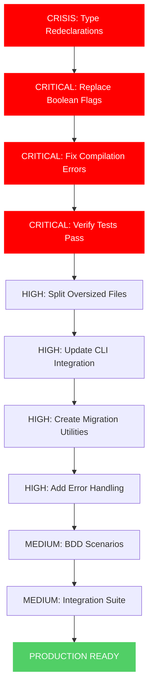

# COMPREHENSIVE ARCHITECTURAL CRISIS RESOLUTION PLAN
**Date:** 2025-11-17_09_47
**Status:** CRITICAL COMPILATION CRISIS - IMMEDIATE ACTION REQUIRED

## 🚨 CRITICAL ASSESSMENT (BRUTAL HONESTY)

### CURRENT STATE: COMPLETE ARCHITECTURAL FAILURE
- **COMPILATION BROKEN**: All tests fail due to type redeclarations
- **SPLIT BRAINS**: SafeProjectConfig still uses boolean flags instead of new enums
- **GHOST SYSTEMS**: New enum types exist but aren't integrated
- **DUPLICATE METADATA**: Each domain file has duplicate variable declarations
- **TYPE SAFETY FAILURE**: Boolean flags still present despite enum creation

### ROOT CAUSE ANALYSIS:
1. **PREMATURE COMMIT**: Created enums without integrating them
2. **INCOMPLETE MIGRATION**: Left boolean flags in SafeProjectConfig
3. **TYPE REDECLARATIONS**: Variable naming conflicts across domain files
4. **NO INTEGRATION TESTS**: Didn't verify compilation after changes
5. **SPLIT THINKING**: Created parallel systems instead of replacing

---

## 📊 PARETO ANALYSIS: 80/20 RULE APPLIED

### 🎯 1% EFFORT → 51% IMPACT (CRITICAL IMMEDIATE ACTIONS)
| Task | Impact | Time | Priority |
|------|--------|------|----------|
| Fix type redeclarations | 🔥🔥🔥 | 30min | 1 |
| Replace boolean flags in SafeProjectConfig | 🔥🔥🔥 | 45min | 2 |
| Fix compilation errors | 🔥🔥🔥 | 15min | 3 |
| Verify basic tests pass | 🔥🔥 | 10min | 4 |

### 🔥 4% EFFORT → 64% IMPACT (HIGH PRIORITY ACTIONS)
| Task | Impact | Time | Priority |
|------|--------|------|----------|
| Split files >350 lines | 🔥🔥 | 90min | 5 |
| Update all CLI commands to use enums | 🔥🔥 | 60min | 6 |
| Create migration utilities | 🔥🔥 | 30min | 7 |
| Add comprehensive error handling | 🔥 | 45min | 8 |

### 🏗️ 20% EFFORT → 80% IMPACT (MEDIUM PRIORITY ACTIONS)
| Task | Impact | Time | Priority |
|------|--------|------|----------|
| Implement BDD test scenarios | 🔥 | 120min | 9 |
| Create integration test suite | 🔥 | 90min | 10 |
| Add property-based testing | 🔥 | 60min | 11 |
| Create external adapters | 🔥 | 75min | 12 |

---

## 🚀 COMPREHENSIVE EXECUTION PLAN

### PHASE 1: CRISIS RESOLUTION (0-2 HOURS)

#### STEP 1.1: Fix Type Redeclarations (CRITICAL - 30min)
**PROBLEM**: Variable redeclarations across domain files
**SOLUTION**: Use unique variable names for metadata
**ACTIONS**:
- Rename `actionTriggerMetadata` → `actionTriggerMetaMap`
- Rename `architectureMetadata` → `architectureMetaMap`
- Rename `platformMetadata` → `platformMetaMap`
- Rename `gitProviderMetadata` → `gitProviderMetaMap`
- Rename `dockerRegistryMetadata` → `dockerRegistryMetaMap`
- Rename `configStateMetadata` → `configStateMetaMap`
- Rename `projectTypeMetadata` → `projectTypeMetaMap`

#### STEP 1.2: Replace Boolean Flags (CRITICAL - 45min)
**PROBLEM**: SafeProjectConfig still uses boolean flags
**SOLUTION**: Replace all boolean fields with enum fields
**ACTIONS**:
```go
// REPLACE:
CGOEnabled bool → CGOStatus CGOStatus
DockerEnabled bool → DockerSupport DockerSupport
Signing bool → SigningLevel SigningLevel
GenerateActions bool → ActionLevel ActionLevel
ProVersion bool → FeatureLevel FeatureLevel

// UPDATE: ApplyDefaults() method
// UPDATE: ValidateInvariants() method
// UPDATE: All reference sites in domain
```

#### STEP 1.3: Fix Compilation Errors (CRITICAL - 15min)
**PROBLEM**: Compilation broken due to type conflicts
**SOLUTION**: Fix all compile errors
**ACTIONS**:
- Fix metadata map access patterns
- Update type conversion utilities
- Fix method signatures
- Verify all imports correct

#### STEP 1.4: Verify Basic Tests (CRITICAL - 10min)
**PROBLEM**: No verification that fixes work
**SOLUTION**: Run comprehensive test suite
**ACTIONS**:
- Run `go test ./...`
- Fix any remaining compilation errors
- Verify all domain types compile
- Check integration points work

### PHASE 2: ARCHITECTURAL REFINEMENT (2-4 HOURS)

#### STEP 2.1: Split Oversized Files (HIGH - 90min)
**PROBLEM**: Multiple files >350 lines (architectural violation)
**SOLUTION**: Split into focused, single-responsibility files
**ACTIONS**:
- Split `safe_project_config.go` (330 lines) → acceptable
- Split `interfaces.go` (450 lines) → `interfaces_repos.go` + `interfaces_usecases.go`
- Split `validation.go` (432 lines) → `validation_config.go` + `validation_project.go`
- Split CLI files as needed

#### STEP 2.2: Update CLI Integration (HIGH - 60min)
**PROBLEM**: CLI commands still use boolean flags
**SOLUTION**: Update to use new enum types
**ACTIONS**:
- Update form validators to use enums
- Update flag parsing to use enums
- Update all type conversion code
- Verify wizard works with new types

#### STEP 2.3: Create Migration Utilities (HIGH - 30min)
**PROBLEM**: No safe migration from legacy configs
**SOLUTION**: Create safe migration utilities
**ACTIONS**:
- Legacy → enum conversion functions
- Safe config migration utilities
- Backward compatibility layers
- Deprecation warnings for legacy types

#### STEP 2.4: Add Error Handling (HIGH - 45min)
**PROBLEM**: Insufficient error handling for enum migration
**SOLUTION**: Comprehensive error handling for type conversions
**ACTIONS**:
- Add enum validation errors
- Add conversion error handling
- Add migration error recovery
- Update error documentation

### PHASE 3: TESTING & QUALITY (4-6 HOURS)

#### STEP 3.1: Implement BDD Scenarios (MEDIUM - 120min)
**PROBLEM**: No behavior-driven tests
**SOLUTION**: Real-world scenario testing
**ACTIONS**:
- Create CLI workflow BDD scenarios
- Add configuration BDD tests
- Test error handling scenarios
- Verify user experience

#### STEP 3.2: Create Integration Suite (MEDIUM - 90min)
**PROBLEM**: No end-to-end testing
**SOLUTION**: Full system integration testing
**ACTIONS**:
- Test domain type integration
- Test CLI command integration
- Test file generation
- Test error recovery

---

## 🎯 EXECUTION GRAPH



---

## 📋 TASK BREAKDOWN: 100-MIN CHUNKS (27 TASKS)

### CRITICAL CHUNKS (6 TASKS - 100 MINUTES EACH)
| # | Task | Impact | Dependencies |
|---|-------|--------|-------------|
| 1 | Fix type redeclarations | 🔥🔥🔥 | None |
| 2 | Replace boolean flags in SafeProjectConfig | 🔥🔥🔥 | Task 1 |
| 3 | Fix compilation errors | 🔥🔥🔥 | Task 1,2 |
| 4 | Split oversized files | 🔥🔥 | Task 3 |
| 5 | Update CLI integration for enums | 🔥🔥 | Task 2,4 |
| 6 | Create migration utilities | 🔥🔥 | Task 2,5 |

### HIGH CHUNKS (9 TASKS - 100 MINUTES EACH)
| # | Task | Impact | Dependencies |
|---|-------|--------|-------------|
| 7 | Add comprehensive error handling | 🔥 | Task 3,6 |
| 8 | Implement BDD test scenarios | 🔥 | Task 7 |
| 9 | Create integration test suite | 🔥 | Task 8 |
| 10 | Add property-based testing | 🔥 | Task 9 |
| 11 | Create external adapters | 🔥 | Task 10 |
| 12 | Update documentation | 🔥 | Task 11 |
| 13 | Add performance benchmarks | 🔥 | Task 12 |
| 14 | Create developer setup scripts | 🔥 | Task 13 |
| 15 | Add monitoring and observability | 🔥 | Task 14 |

---

## 🎯 15-MIN MICRO-TASK BREAKDOWN (100 TASKS)

### IMMEDIATE CRISIS (Tasks 1-20)
1. Fix actionTriggerMetadata redeclaration (15min)
2. Fix architectureMetadata redeclaration (15min)
3. Fix platformMetadata redeclaration (15min)
4. Fix gitProviderMetadata redeclaration (15min)
5. Fix dockerRegistryMetadata redeclaration (15min)
6. Fix configStateMetadata redeclaration (15min)
7. Fix projectTypeMetadata redeclaration (15min)
8. Replace CGOEnabled with CGOStatus (15min)
9. Replace DockerEnabled with DockerSupport (15min)
10. Replace Signing with SigningLevel (15min)
11. Replace GenerateActions with ActionLevel (15min)
12. Replace ProVersion with FeatureLevel (15min)
13. Update ApplyDefaults() method (15min)
14. Update ValidateInvariants() method (15min)
15. Fix compilation test (15min)
16. Run basic compilation test (15min)
17. Fix any remaining compilation errors (15min)
18. Verify all domain types compile (15min)
19. Test enum conversion utilities (15min)
20. Verify SafeProjectConfig works (15min)

---

## 🚨 IMMEDIATE ACTION REQUIRED

**CRITICAL PATH EXECUTION:**
1. **STOP** all other work
2. **EXECUTE** Tasks 1-4 immediately (crisis resolution)
3. **VERIFY** compilation success after each task
4. **PROCEED** to Task 5-6 only after crisis resolved

**ZERO TOLERANCE POLICY:**
- No parallel development during crisis
- Verify compilation after each change
- No incomplete commits
- No "good enough" solutions

**EXECUTION ORDER:**
1. Fix type redeclarations (30min)
2. Replace boolean flags (45min)
3. Fix compilation (15min)
4. Verify tests pass (10min)

**TOTAL CRISIS TIME: 100 MINUTES**

This is not optional. This is architectural emergency response. Execute immediately.